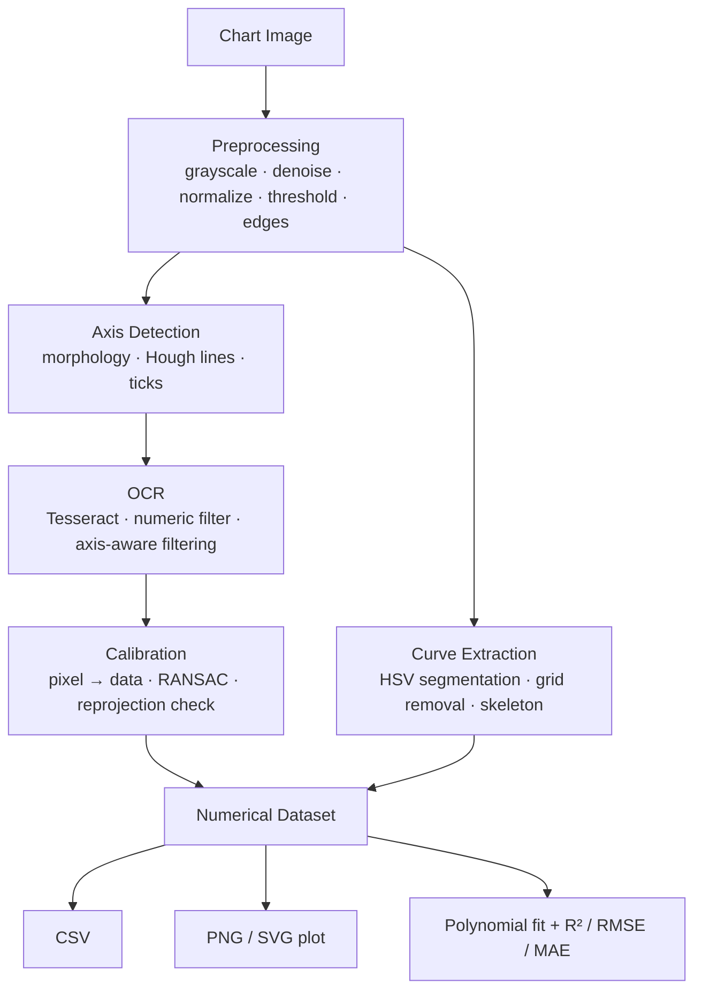

# 📈 VisionPlot

**Turn a chart image into real, usable data.**

VisionPlot is a computer-vision pipeline that reads a chart image, finds its axes, reads the tick labels with OCR, calibrates pixels to data units, traces the plotted curve, and gives you back numerical `(x, y)` points, ready for CSV export, plotting, and curve fitting.


---

## Table of Contents

- [Why VisionPlot?](#why-visionplot)
- [How It Works](#how-it-works)
- [Features](#features)
- [Quick Start](#quick-start)
- [Example](#example)
- [Under the Hood](#under-the-hood)
- [Project Structure](#project-structure)
- [Limitations](#limitations)
- [Roadmap](#roadmap)
- [Troubleshooting](#troubleshooting)
- [Author](#author)
- [License](#license)

---

## Why VisionPlot?

Charts in papers, reports, and scanned documents hold data that is locked inside pixels. When the original dataset is gone, people re-digitize plots by hand, point by point.

VisionPlot automates that process:

```text
Image → Pixels → Axes + OCR → Calibration → Curve → (x, y) data
```

No manual clicking on the curve and no manual axis calibration. You upload an image and get a dataset.

---

## How It Works



| Stage | What happens |
| --- | --- |
| **1. Preprocess** | Grayscale, edge-preserving denoising, illumination normalization, Otsu thresholding, Canny edges |
| **2. Detect axes** | Morphological filtering and Hough transform find the long horizontal and vertical lines; tick marks are located along them |
| **3. Read labels** | Tesseract reads numeric labels; detections are filtered by geometry so X labels belong to the X axis and Y labels to the Y axis |
| **4. Calibrate** | Tick pixels are paired with label values and a robust RANSAC fit maps pixel space to data space |
| **5. Extract curve** | The curve color is detected automatically, segmented in HSV, cleaned of axes and grid lines, skeletonized, and pruned |
| **6. Output** | Pixels become `(x, y)` points, which are resampled, exported, plotted, and fitted |

---

## Features

**Extraction**
- Automatic axis, tick, and plotted-curve detection
- Automatic curve color detection with HSV segmentation
- Axis and grid-line removal, connected-component filtering, skeletonization, and branch pruning
- Uniform data resampling

**Calibration and reliability**
- Tesseract OCR for numeric tick labels, with axis-aware spatial filtering
- RANSAC-based calibration that tolerates misread labels
- Reprojection check to validate the pixel-to-data transform

**Analysis and export**
- Polynomial curve fitting with **R²**, **RMSE**, and **MAE**
- CSV export of extracted data
- PNG and SVG export of the reconstructed graph

**Dashboard**
- Streamlit UI that shows every stage: detected axes, OCR labels, curve overlay, reconstructed plot, and data table

---

## Quick Start

### 1. Clone

```bash
git clone https://github.com/codewithtrisha09/Vision-Plot.git
cd Vision-Plot
```

### 2. Create a virtual environment

```bash
python -m venv venv
```

| OS | Activate |
| --- | --- |
| Windows (PowerShell) | `.\venv\Scripts\activate` |
| macOS / Linux | `source venv/bin/activate` |

### 3. Install dependencies

```bash
pip install -r requirements.txt
```

### 4. Install Tesseract OCR

Tesseract is a separate program that `pytesseract` calls. Python packages alone are not enough.

| OS | Install |
| --- | --- |
| Windows | Download the installer from the [UB Mannheim builds](https://github.com/UB-Mannheim/tesseract/wiki). VisionPlot auto-detects common paths such as `C:\Program Files\Tesseract-OCR\tesseract.exe` |
| macOS | `brew install tesseract` |
| Ubuntu / Debian | `sudo apt install tesseract-ocr` |

### 5. Run

From the project root:

```bash
streamlit run VP/app.py
```

(On Windows PowerShell, `.\VP\app.py` also works.) The dashboard opens in your browser. Upload a chart and the pipeline runs end to end.

---

## Example

### Calibration

Recognized ticks give anchor points that link pixels to data:

```text
Pixel         →  Data
(614, 717)    →  (0, 0)
(840, 717)    →  (2, 0)
(614, 534)    →  (0, 2)
```

Each axis gets its own linear map. Here the X scale is `226 px / 2 units = 113 px/unit` and the Y scale is `183 px / 2 units = 91.5 px/unit`, so aspect ratio does not need to be square.

### Extracted data

For a chart with X from `-5` to `5` and Y from `0` to `8`:

```text
X          Y
-4.9765    0.1726
-4.9265    0.1845
-4.8764    0.1845
...
```

### Curve fit

```text
y = 0.0764x² + 0.4729x + 0.9746
```

| Metric | Meaning |
| --- | --- |
| **R²** | How much of the variation in the extracted data the model explains (closer to 1 is better) |
| **RMSE** | Typical size of fit error, in the same units as `y`, penalizing large misses |
| **MAE** | Average absolute fit error, in the same units as `y` |

> ⚠️ The fitted polynomial approximates the *extracted points*. It is not necessarily the equation that generated the original chart.

---

## Under the Hood

**Computer-vision techniques used**

| Technique | Purpose |
| --- | --- |
| Bilateral / guided filtering | Denoise while preserving edges |
| Median filtering | Estimate and remove uneven background |
| Illumination normalization | Reduce lighting gradients |
| Otsu thresholding | Binarize automatically |
| Canny edges | Find strong boundaries |
| Morphological processing | Isolate axis and grid structure |
| Hough line detection | Find long horizontal and vertical lines |
| ROI processing | Restrict work to the plot area |
| HSV segmentation | Separate the curve by color |
| Connected components | Drop small noise regions |
| Skeletonization + pruning | Reduce the curve to a clean 1-px path |
| OCR | Read numeric tick labels |
| RANSAC | Fit calibration despite bad detections |
| Reprojection | Validate the pixel → data transform |

**Tech stack:** Python · OpenCV · NumPy · Pandas · Pillow · Tesseract + pytesseract · Matplotlib · Streamlit

---

## Project Structure

```text
Vision-Plot/
├── VP/
│   ├── app.py                    # Streamlit dashboard
│   └── src/chart_extractor/
│       ├── preprocess.py         # Grayscale, denoise, normalize, threshold, edges
│       ├── axes.py               # Axis and tick detection
│       ├── ocr.py                # Tesseract OCR and label filtering
│       ├── calibration.py        # Pixel → data mapping, RANSAC
│       ├── curve.py              # Segmentation, skeleton, point extraction
│       ├── pipeline.py           # Orchestrates the full flow
│       └── types.py              # Shared data structures
├── requirements.txt
├── README.md
└── .gitignore
```

---

## Limitations

VisionPlot works best on a **single, clearly colored curve with numeric, linear axes**. Results degrade with:

- Low-resolution or heavily compressed images
- Multiple or overlapping curves
- Curve color close to the background or grid
- Dense grid lines
- Rotated or irregular layouts
- Non-numeric labels
- Logarithmic or other non-linear axes
- Complex multi-panel charts

---

## Roadmap

- [ ] Multiple curves per chart, with legend matching
- [ ] Logarithmic axis support
- [ ] OCR confidence scoring
- [ ] Automatic model selection for curve fitting
- [ ] Scatter plot and bar chart support
- [ ] Rotated chart correction
- [ ] Deep-learning curve segmentation
- [ ] Automatic chart-type classification
- [ ] Manual correction of axes and OCR labels in the UI
- [ ] Excel (`.xlsx`) export
- [ ] Benchmark on a labeled chart dataset, with published accuracy numbers

---

## Troubleshooting

| Problem | Likely fix |
| --- | --- |
| `TesseractNotFoundError` | Install Tesseract and make sure the executable is on your `PATH`, or set `pytesseract.pytesseract.tesseract_cmd` to its full path |
| Axis labels read wrong or missing | Use a higher-resolution image with crisp, dark tick labels |
| Curve not detected | Make sure the curve has a color distinct from the background and grid |
| Extra points on the curve | Crop out legends, titles, and annotations before uploading |

---

## Author

**Trisha Shetty**
B.Tech, Computer Science and Engineering (AI & ML), MIT Manipal

## License

Currently intended for academic and educational use.
